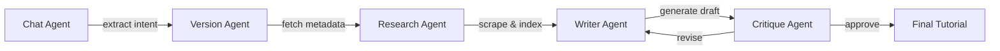

# DevAgent Lab 🤖

AI-powered tutorial generator that creates comprehensive "Getting Started" guides for any library using multi-agent workflows to help developers learn new libraries.

## Features

✨ **Automated Tutorial Generation** - Just provide a library name, get a complete tutorial  
🔍 **Version-Aware** - Automatically detects the latest version and ensures compatibility  
📚 **Multi-Source Research** - Scrapes official docs, GitHub examples, and changelog  
💾 **Vector Search** - Indexes documentation in ChromaDB for semantic retrieval  
🔄 **Quality Control** - Critique agent validates for deprecated methods and accuracy  
🌐 **Multi-Language** - Supports Python and JavaScript libraries

## Architecture



**5 Specialized Agents:**
- **Chat Agent**: Parses user intent and handles Q&A
- **Version Agent**: Detects language and fetches latest version info from PyPI/npm
- **Research Agent**: Scrapes docs, finds GitHub examples, creates vector index
- **Writer Agent**: Generates tutorial using RAG over indexed docs
- **Critique Agent**: Validates for deprecated methods, breaking changes, and quality

## Installation

```bash
# Clone the repository
git clone https://github.com/Kellysmoky123/DevAgent
cd DevAgent

# Install dependencies using uv
uv sync
```

## Configuration

Create a `.env` file with your API keys:

```env
MEGALLM_API_KEY=your_megallm_key        # For LLM inference
TAVILY_API_KEY=your_tavily_key          # For web search
GOOGLE_API_KEY=your_google_key          # For embeddings
GITHUB_TOKEN=your_github_token          # Optional: increases API limits
LANGFUSE_SECRET_KEY=your_secret_key     # Optional: for observability traces
LANGFUSE_PUBLIC_KEY=your_public_key     # Optional: for observability traces
LANGFUSE_BASE_URL=https://cloud.langfuse.com  # Optional: Langfuse host
```

The LLM model is configured centrally in `config/models.py`. You can use any provider that supports the OpenAI API format.

## Usage

```bash
streamlit run app.py
```

## Project Structure

```
devagent/
├── agents/           # 5 LangGraph agent nodes
│   ├── chat_agent.py
│   ├── version_agent.py
│   ├── research_agent.py
│   ├── writer_agent.py
│   └── critique_agent.py
├── config/           # Centralized configuration
│   ├── models.py         # LLM model & rate limiter
│   ├── logger.py         # Centralized logging setup
│   └── langfuse_config.py # Observability tracing
├── tools/            # Reusable tools for agents
│   ├── version_checker.py
│   ├── doc_scraper.py
│   ├── github_tool.py
│   ├── llamaindex_manager.py
│   └── tavily_search.py
├── graphs/
│   ├── state.py      # TypedDict for agent state
│   └── workflow.py   # LangGraph workflow builder
└── app.py            # Streamlit app entrypoint
```

### Adding New Tools

1. Create tool in `tools/` directory
2. Decorate with `@tool` from `langchain_core.tools`
3. Add to relevant agent's tool list in `agents/`

## Tech Stack

- **LangGraph**: Multi-agent orchestration
- **LangChain**: Agent framework and tool integration
- **LlamaIndex**: Document indexing and RAG
- **ChromaDB**: Vector store
- **Tavily**: Web search
- **GitHub API**: Code example extraction
- **Trafilatura**: Web scraping
- **Langfuse**: Observability and tracing

## Contributing

Contributions welcome! Areas for improvement:
- Support for more languages (Go, Rust, etc.)
- Tutorial quality metrics and A/B testing
- Caching layer for version/docs lookups

## License

MIT
